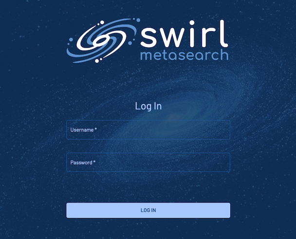
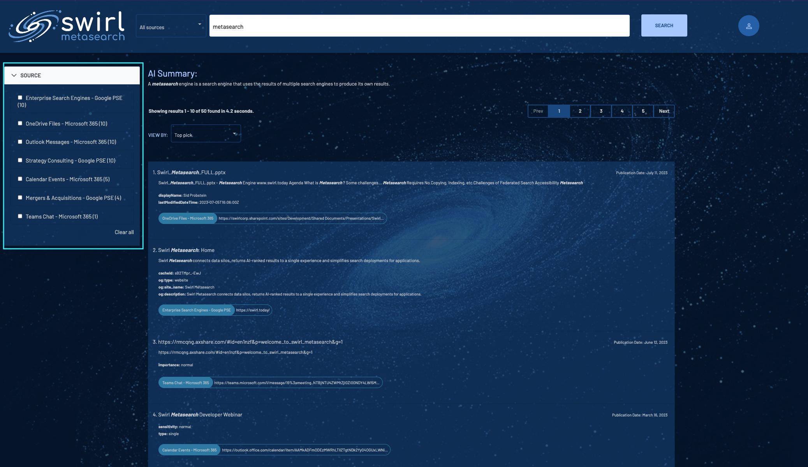
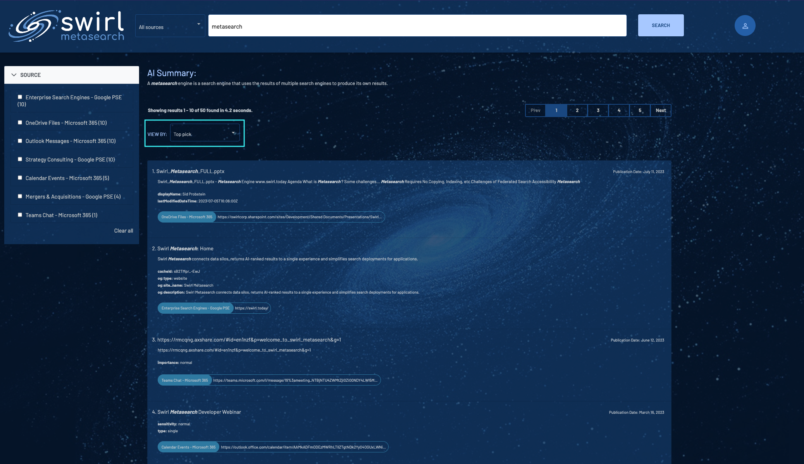

# Guia do Usuário
{:.no_toc}

**Conteúdo**
* TOC
{:toc}

Este guia é destinado a desenvolvedores, cientistas de dados, gerentes de programa ou qualquer pessoa que deseja usar o Swirl Metasearch, incluindo a pesquisa e personalização de SearchProviders.

Para informações de fundo sobre o Swirl, consulte [O que é Metasearch](Home#what-is-metasearch-is-it-the-same-as-federated-search) e [O que é o Swirl Metasearch?](Home#what-is-swirl-metasearch).

<br/>

# Terminologia

| Palavra | Explicação | 
| ---------- | ---------- |
| SearchProvider | Um objeto que define uma fonte pesquisável. Isso inclui metadados que identificam o tipo de conector usado para pesquisar a fonte e mais informações. |
| Pesquisa | Um objeto que define uma consulta que algum usuário ou sistema deseja executar. Isso inclui a `query_string` com o texto real e metadados. A maioria dos metadados é opcional.|
| Consulta | Motores de busca fazem uma distinção entre o ato de pesquisar e o que vai para uma pesquisa. As palavras-chave do usuário ou outros termos de pesquisa são normalmente referidos como uma consulta. O Swirl segue essa convenção sempre que possível, mas, às vezes, pode se referir a uma pesquisa como uma consulta. Desculpe por isso. |
| Inscrever | Uma propriedade importante dos objetos de Pesquisa. Quando definido como `true`, o Swirl periodicamente executará a pesquisa, especificando uma ordenação por data para obter dados mais recentes e removendo duplicatas dos resultados.|
| Conector | Um módulo do Swirl que pode se conectar a uma fonte de dados específica e fazer consultas. Conectores são uma camada sobre algum pacote Python existente, como `request.get` ou `elasticsearch`.|
| Classificação de Relevância | Uma estimativa do valor relativo de um resultado de mecanismo de pesquisa em relação à consulta do usuário, em comparação com todos os outros - para simplificar. Para mais informações: [https://en.wikipedia.org/wiki/Relevance_(information_retrieval)](https://en.wikipedia.org/wiki/Relevance_(information_retrieval)) | 

<br/>

# Executando uma Pesquisa

* Abra esta URL em um navegador: <http://localhost:8000/> (ou <http://localhost:8000/galaxy>)

Se a página de pesquisa aparecer, clique em `Sair` no canto superior direito. A página de login do Swirl aparecerá:



* Digite o nome de usuário `admin` e a senha `password`, e clique em `Login`.

* Digite uma pesquisa na caixa de pesquisa e pressione o botão `Pesquisar`. Os resultados classificados aparecem em apenas alguns segundos:


<br/>

:warning: A versão Docker do Swirl *não* retém dados ou configuração quando desligada!

:key: O Swirl inclui quatro (4) Motores de Pesquisa Programáveis do Google (PSEs) para que você comece a usar imediatamente. As credenciais para esses motores são compartilhadas com a Comunidade Swirl.

:key: Usar o Swirl com o Microsoft 365 requer instalação e aprovação por um Administrador autorizado da empresa. Para obter mais informações, consulte o [Guia M365](4.-M365-Guide.md) ou [entre em contato conosco](mailto:hello@swirl.today).

## Filtrando Resultados por Fonte



O Swirl retorna os melhores resultados de todas as fontes disponíveis por padrão. Para filtrar os resultados por uma ou mais fontes, marque uma ou mais caixas de `Fonte`, conforme mostrado acima. Os resultados são instantaneamente filtrados apenas para essas fontes.

Clique em `Limpar Tudo` para voltar a ver todos os resultados.

## Ordenando Resultados



O Swirl apresenta resultados classificados por relevância por padrão. Para classificar por `Data` ou ver as `Melhores Escolhas` de cada silo, clique na lista suspensa `VISUALIZAR POR` e selecione sua preferência.

#### Observações
* O Swirl oculta resultados que não têm um valor de `date_published` ao classificar por `Data`.
* A partir da versão 2.5, o `DateFindingResultProcessor` foi adicionado ao Google PSE SearchProvider JSON. Ele encontra uma data em uma grande porcentagem de resultados que, de outra forma, não teriam uma, e copia a data para o campo `date_published`.

## Navegando pelos Resultados


Para navegar pelos resultados, use os seletores de página numerada ou os botões `Anterior` e `Próximo` acima da lista de resultados, como mostrado acima.

## Iniciando uma Nova Pesquisa

Clique no logotipo do Swirl (canto superior esquerdo da página) a qualquer momento para redefinir o formulário de pesquisa do Galaxy.

## Sintaxe de Pesquisa

A tabela a seguir resume as opções de sintaxe de pesquisa atuais do Swirl:

| Sintaxe | Tratamento | Notas | 
| ---------- | ---------- | ---------- |
| E, OU       | Passado para todos os SearchProviders | O Swirl não verifica a conformidade | 
| NÃO, -termo    | Passado para os SearchProviders configurados e reescrito, se necessário; removido da consulta para provedores que não suportam `NÃO` ou `-termo` | O Swirl verifica a conformidade; e também diminui o peso e sinaliza as respostas que incluíram termos NÃO |
| tag:termo | Passa `termo` para os SearchProviders configurados com ele em seu campo `tags`. A parte não etiquetada da consulta é descartada. Se `tag:` começar a consulta, apenas os provedores com essa Etiqueta serão pesquisados. | Exemplo: `empresa de veículos elétricos:tesla`<br/>Apenas o termo `tesla` irá para os SearchProviders com a Etiqueta `empresa`, desde que estejam ativos.<br

/>Exemplo: `empresa:facebook`<br/>A consulta `facebook` irá apenas para os SearchProviders com a Etiqueta `empresa`. |

### E, OU

E e OU são passados para todos os SearchProviders. O Swirl não verifica a conformidade dos resultados de qualquer SearchProvider.

### NÃO

* O NÃO é mantido em consultas para SearchProviders com `NOT=True` em suas `query_mappings`. O NÃO se aplica a todos os termos que o seguem.

* O NÃO é reescrito como `-termo` para SearchProviders com `NOT_CHAR=-` e `NOT=False` (ou não especificado). O `-termo` se aplica a todos os termos que o seguem.

* O NÃO e os termos NÃO são removidos da consulta para os provedores que não têm `NOT=True` em `query_mappings`.

O Swirl verifica as respostas em busca de conformidade com as declarações NÃO. As respostas que contêm conteúdo NÃO são diminuídas de peso.

### Sintaxe de Mais/Menos (+/-)

* Um `+` (MAIS) prefixado a qualquer termo de pesquisa é mantido no termo da consulta e passado para todos os SearchProviders.

* Um `-` (MENOS) prefixado a qualquer termo de pesquisa é mantido nas consultas para SearchProviders com `NOT_CHAR=-` configurado em suas `query_mappings`. O MENOS é reescrito para seguir o NÃO para qualquer fonte com `NOT=True` e sem `NOT_CHAR=-` em `query_mappings`.

* Todos os termos prefixados com `-` (MENOS) são removidos da consulta para provedores que não têm `NOT_CHAR=-` em `query_mappings`.

## Usando Etiquetas para Direcionar SearchProviders

Os SearchProviders podem receber Etiquetas arbitrárias que definem algum escopo - tópico, tipo de entidade ou qualquer conceito(s) que se espera que a fonte conheça. Por exemplo, `empresa`, ou `pessoa`, ou `financeiro`. Essas Etiquetas podem ser usadas em pesquisas para direcionar partes específicas da consulta para fontes específicas.

Por exemplo, o conjunto de dados de financiamento incluído no Swirl possui SearchProviders para SQLite3, PostgreSQL e Google BigQuery, todos com Etiquetas:

``` shell
{
    "name": "Registros de Financiamento de Empresas (cloud/BigQuery)",
    "connector": "BigQuery",
    ...etc...
    "tags": [
        "Empresa",
        "BigQuery"
    ]
}
```

A consulta a seguir direciona a Etiqueta `empresa` nesses SearchProviders:

``` shell
empresa de veículos elétricos:tesla
```

Para SearchProviders com essa Etiqueta, o Swirl reescreve a consulta apenas para os termos que a seguem. Neste caso, o SearchProvider BigQuery receberá a consulta:

``` shell
tesla
```

Um registro de financiamento direto tem boas chances de estar classificado nos 10 melhores resultados, dependendo do que são. Por exemplo:

Espero que isso ajude! Se você tiver mais alguma dúvida ou precisar de mais assistência, fique à vontade para perguntar.

```shell
"results": [
        {
            "swirl_rank": 1,
            "swirl_score": 1316.565600582163,
            "searchprovider": "Registros de Financiamento da Empresa (nuvem/BigQuery)",
            "searchprovider_rank": 1,
            "title": "*Tesla* Motors",
            "url": "tesla-motors",
            "body": "*Tesla* Motors levantou $40000000 em uma série C em 2006-05-01. *Tesla* Motors está localizada em San Carlos, CA e possui 270 funcionários.",
            "date_published": "2006-05-01 00:00:00",
            "date_retrieved": "2023-01-11 12:16:43.302730",
            "author": "",
            "payload": {},
            "explain": {
                "stems": "tesla",
                "title": {
                    "tesla_*": 0.8357298742623626,
                    "Tesla_0": 0.8357298742623626,
                    "result_length_adjust": 4.5,
                    "query_length_adjust": 1.0
                },
                "body": {
                    "Tesla_0": 0.7187157993182859,
                    "result_length_adjust": 1.25,
                    "query_length_adjust": 1.0
                }
            }
        }
```

Se uma consulta começa com `tag:`, então somente os SearchProviders com essa tag serão selecionados, independentemente do seu status padrão. (Claro, eles ainda precisam estar ativos.)

Por exemplo:

```shell
empresa: facebook
```

Isso limitará a consulta aos SearchProviders com a tag `empresa`.

Os SearchProviders não precisam ter a propriedade `default` definida como `true` para que as Tags funcionem. Contanto que tenham `active` definido como `true`, usar a Tag em uma consulta fará com que o Swirl o invoque.

Para obter mais informações, consulte [Organizando SearchProviders com Active, Default e Tags](#organizing-searchproviders-with-active-default-and-tags).

Relevância de classificação

O Swirl retorna um conjunto de resultados unificado composto por resultados de todos os SearchProviders que respondem, correspondem à forma da palavra raiz e reclassifica usando um modelo de relevância de similaridade de vetor cosseno baseado em [spaCy](https://spacy.io/) e normalizado pelo comprimento da consulta e dos tokens. Ele também incorpora o `searchprovider_rank` original.

Para obter mais detalhes, consulte [Configurar Pesos de Campo de Relevância](5.-Developer-Guide.md#configure-relevancy-field-weights) e as seções [Entender a Estrutura do Explain](5.-Developer-Guide.md#understand-the-explain-structure) do Guia do Desenvolvedor.

Realçar destaques

Os destaques do Swirl ocorrem nas ocorrências de termos de consulta nos campos `title`, `body` e `author`. Por exemplo:

```shell
    "body": "<em>Gestão de desempenho</em> é o processo de definição de metas e expectativas para os funcionários e, em seguida, acompanhamento e medição de seu progresso. Isso pode ser feito por meio de reuniões individuais regulares, avaliações de desempenho e outros mecanismos de feedback.",
```

A partir da versão 1.10, o Swirl também pode integrar configurações de sinônimos de fonte nos cálculos de relevância com realces correspondentes. Consulte a seção [Integrar Sinônimos de Fonte nos Cálculos de Relevância do Swirl](5.-Developer-Guide.md#integrate-source-synonyms-into-swirl-relevancy) do Guia do Desenvolvedor para obter detalhes.

Usando SearchProviders

Os SearchProviders são o elemento essencial do Swirl. Eles tornam rápido e fácil pesquisar muitas fontes - sem escrever código.

Os SearchProviders são objetos JSON. A distribuição do Swirl inclui configurações pré-carregadas para fontes como Elastic, Solr, PostgreSQL, BigQuery, NLResearch.com, Miro.com, Atlassian e muito mais.

:key: O Swirl inclui quatro (4) Mecanismos de Pesquisa Programável do Google (PSE) para colocá-lo em funcionamento imediatamente. As credenciais para esses são compartilhadas com a Comunidade Swirl.

[Exemplo JSON de SearchProvider](https://github.com/swirlai/swirl-search/tree/main/SearchProviders)

| SearchProvider | Descrição | Notas |
| ---------- | ---------- | ---------- | 
| arxiv.json | Pesquisa no repositório [arXiv.org](https://arxiv.org/) de artigos científicos | Não requer autorização |
| atlassian.json | Atlassian [Confluence Cloud](https://www.atlassian.com/software/confluence) e [Jira Cloud](https://www.atlassian.com/software/jira) | Requer um token de portador; Confluence pesquisa o conteúdo [CQL `text~`](https://developer.atlassian.com/server/confluence/performing-text-searches-using-cql/) e Jira pesquisa o conteúdo [JQL `text~`](https://support.atlassian.com/jira-software-cloud/docs/what-is-advanced-searching-in-jira-cloud/#Advancedsearching-textPerformingtextsearches) |
| chatgpt.json | ChatGPT AI chatbot | Requer uma chave de API da OpenAI |
| document_db.json | Banco de dados de documentos SQLite3 | [documents_db.csv](https://github.com/swirlai/swirl-search/tree/main/Data/documents_db.csv) |
| elastic_cloud.json | elasticsearch, versão em nuvem | [Conjunto de Dados de Email da Enron](6.-Developer-Reference.md#enron-email-data-set) requer cloud_id, credenciais |
| elasticsearch.json | elasticsearch, instalação local | [Conjunto de Dados de Email da Enron](6.-Developer-Reference.md#enron-email-data-set) requer host, porta, credenciais | 
| europe_pmc.json | Pesquisa no repositório [EuropePMC.org](https://europepmc.org/) de literatura de ciências da vida | Não requer autorização |
| funding_db_bigquery.json | Banco de dados de financiamento do BigQuery  | [Conjunto

 de Dados de Registros de Financiamento da Empresa](6.-Developer-Reference.md#company-funding-records-data-set) |
| funding_db_sheets.json | Banco de dados de financiamento do Google Sheets | [Folha de cálculo de Registros de Financiamento da Empresa](6.-Developer-Reference.md#company-funding-records-data-set) |
| github.json | Pesquisa no [GitHub.com](https://github.com/) e [GitHub Enterprise Cloud](https://enterprise.github.com/cloud) e [GitHub Enterprise Server](https://enterprise.github.com/server) | Requer um token de portador |
| jenkins.json | JenkinsCI | Requer uma chave de API JenkinsCI |
| miro.json | Miro [miro.com](https://miro.com/) | Requer um token de portador |
| moneycontrol.json | MoneyControl Notícias | Requer uma chave de API |
| postgrest.json | PostgREST, API auto-gerada para o PostgreSQL | Requer uma URL PostgREST |
| postgres.json | Pesquisa no PostgreSQL | Requer host, porta, credenciais |
| research_db_sheets.json | Banco de dados de pesquisa do Google Sheets | [Folha de cálculo de Registro de Pesquisa](6.-Developer-Reference.md#research-record-data-set) |
| salesforce.json | Salesforce | Requer uma URL MyDomain |
| sentryio.json | Sentry.io | Requer uma chave de API |
| sheets.json | Pesquisa no Google Sheets | Requer um arquivo de folha de cálculo do Google Sheets |
| slack.json | Pesquisa no Slack | Requer um token de portador |
| solr.json | Pesquisa no Solr, [Conjunto de Dados da Enron Email](6.-Developer-Reference.md#enron-email-data-set) | Requer host, porta, credenciais |
| sonarqube.json | SonarQube | Requer um token de usuário |
| stackoverflow.json | Pesquisa na StackOverflow | Não requer autorização |
| zendesk.json | Zendesk | Requer uma URL MyDomain |

Aqui está um exemplo de como usar o Swirl para fazer uma consulta em todos os SearchProviders que estão ativos:

```shell
empresa: Tesla
```

Isso pesquisaria por informações relacionadas à empresa Tesla em todos os SearchProviders ativos.

Espero que essas informações tenham sido úteis. Se você tiver alguma outra pergunta ou precisar de mais assistência, fique à vontade para perguntar.